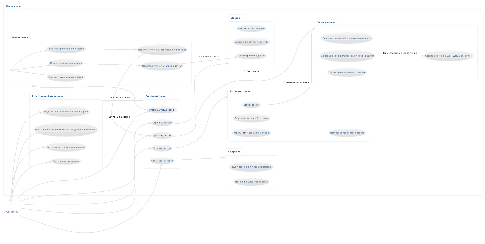

# Глоссарий терминов
1. Предложение - фильм или сериал, которые пользователь видит у себя на экране в процессе выбора.
2. Сессия - непосредственно сам процесс выбора фильма/сериала группой лиц.
3. Мэтч - совпадение предложений у всех пользователей.
4. Пользователь – зарегистрированный посетитель сервиса.

# Модели требований
## Предметная область
### Объекты предметной области
1. Пользователь - зарегистрированный посетитель сервиса. 
2. Регистрация и авторизация - процесс идентификации пользователя в системе. 
3. Стартовый экран - главная страница приложения
4. Создание сессии - процесси формирования новой сессии, задание настроек сессии и приглашение друзей в неё. 
5. Сессия выбора - процесс выбора фильма/сериала участниками сессии. 
6. Друзья - страница в приложении, на которой отображаются все пользователи связанные с текущим. 
7. Уведомления - оповещение о новом действии внутри приложения (заявка в друзья, добавление в сессию) либо информационное сообщение. 
8. Настройки - управление личными данными пользователя и параметрами приложения. 
### Связи между объектами

## Модели пользователей системы
### Список пользователей
1. Пользователь - зарегистрированный посетитель сервиса. 
2. Гости - посетители сервиса, которые не подтвердили почту. 
### Права пользователей
Пользователь может:
1. Зарегистрироваться/авторизоваться с использованием логина и пароля
2. Зарегистрироваться/авторизоваться с использованием стороннего сервиса авторизации через OAuth Google
3. Подтвердить свою почту, открыв сообщение с подтверждением на своей почте. 
4. Выбрать доступную сессию и перейти в её интерфейс. 

5. Перейти на страницу друзей. 
6. Перейти на страницу уведомлений. 
7. Просматривать предложения и их подробную информацию во время сессии. 
8. Взаимодействовать с карточкой фильма:
    8.1. Смахнуть влево -> фильм интересен
    8.2 Смахнуть вправо -> фильм не интересен
    8.3 Нажать на карточку фильм / смахнуть вверх -> посмотреть более подробную информацию о фильме
9. Увидеть мэтч. 
10. Изменить личную информацию в настройках. 
11. Задать имя сессии и период ее жизни
12. Перейти на страницу с настройками. 
13. Создать новую сессию. 
14. Приглашать своих друзей присоединиться к сессии
15. Управлять параметрами поиска фильма (жанр, возрастные ограничения и т.д.)
16. Начать сессию
17. Просматривать уже добавленных друзей
18. Добавлять друзей по нику или id
19. Приглашать друзей
20. Просматривать уведомления о произошедшем за время его отсутствия мэтче
21. Нажатие на это уведомление о мэтче демонстрирует информацию о выбранном фильме
22. Просматривать уведомления о запросе в друзья
23. Нажатием на уведомление о запросе в друзья он может принять или отклонить приглашение
24. Просматривать уведомления о присоединении к сессии
25. Нажатием на уведомление о присоединении к сессии он может принять или отклонить приглашение