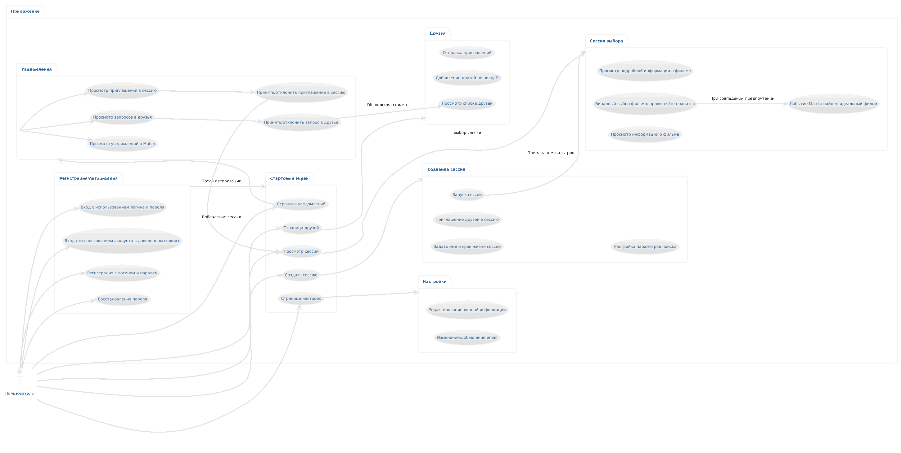
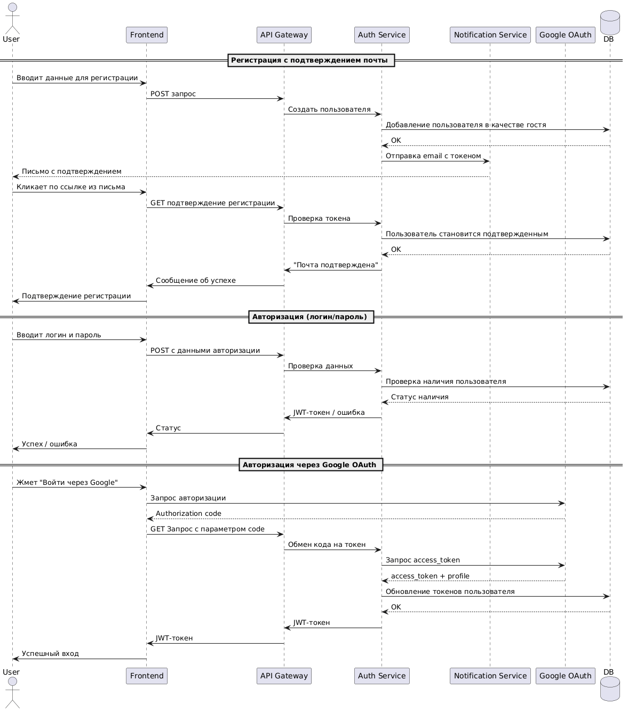
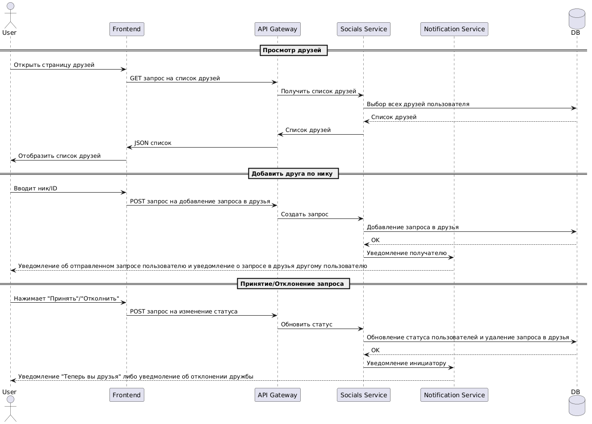
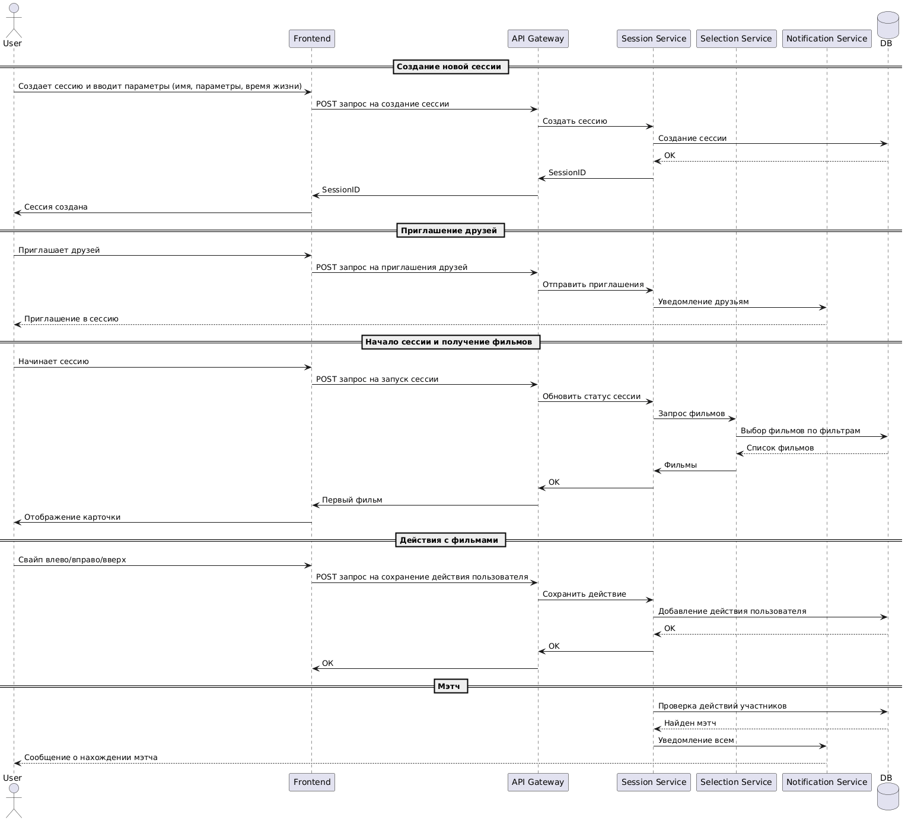
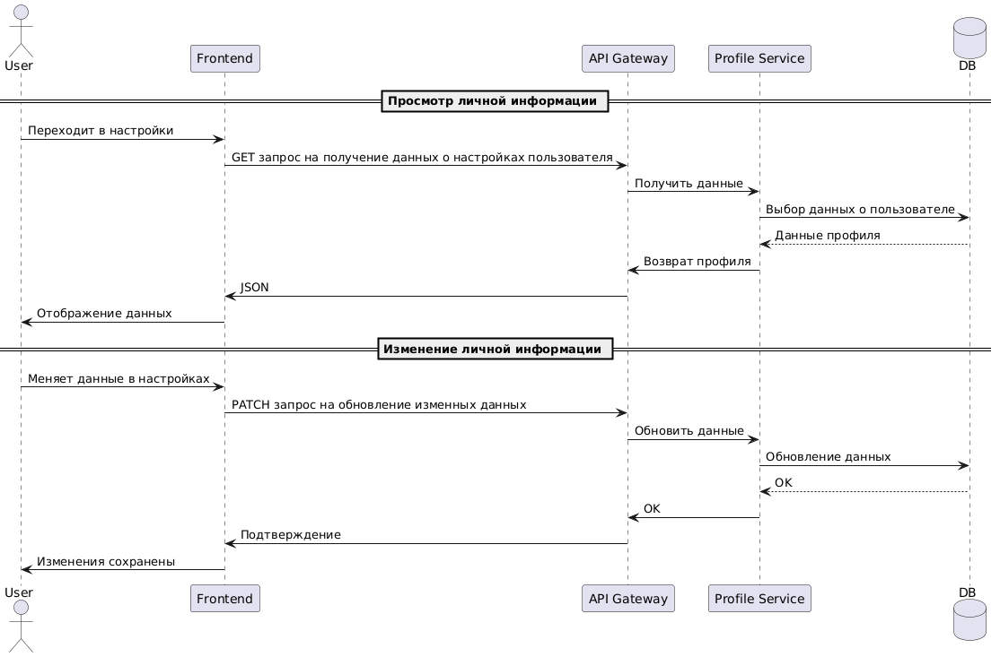
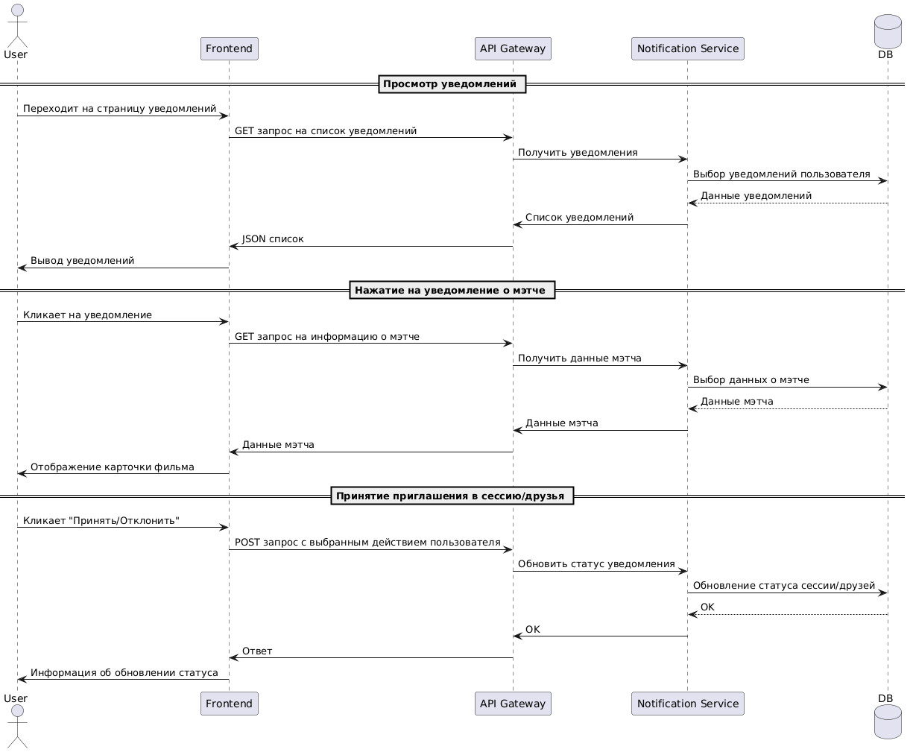
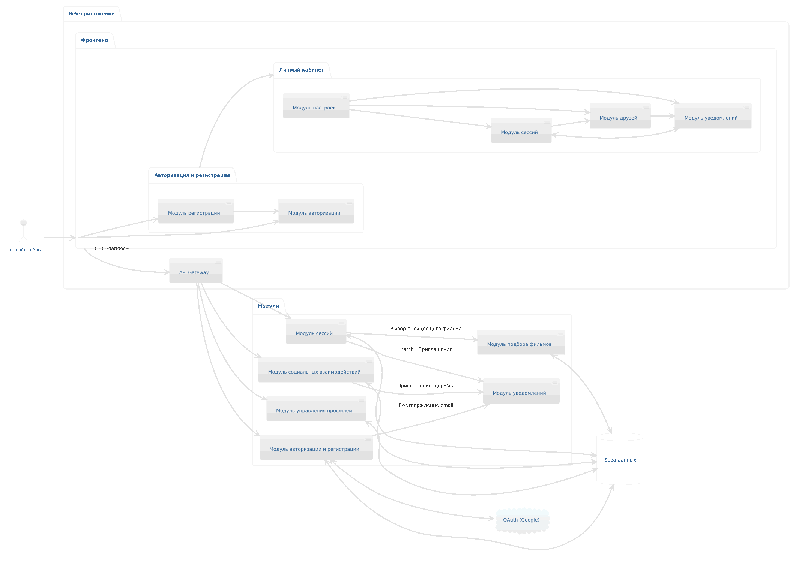

# Глоссарий терминов
1. Предложение - фильм или сериал, которые пользователь видит у себя на экране в процессе выбора.
2. Сессия - непосредственно сам процесс выбора фильма/сериала группой лиц.
3. Мэтч - совпадение предложений у всех пользователей.
4. Пользователь – зарегистрированный посетитель сервиса.

# Модели требований
## Предметная область
### Объекты предметной области
1. Пользователь - зарегистрированный посетитель сервиса. 
2. Регистрация и авторизация - процесс идентификации пользователя в системе. 
3. Стартовый экран - главная страница приложения
4. Создание сессии - процесси формирования новой сессии, задание настроек сессии и приглашение друзей в неё. 
5. Сессия выбора - процесс выбора фильма/сериала участниками сессии. 
6. Друзья - страница в приложении, на которой отображаются все пользователи связанные с текущим. 
7. Уведомления - оповещение о новом действии внутри приложения (заявка в друзья, добавление в сессию) либо информационное сообщение. 
8. Настройки - управление личными данными пользователя и параметрами приложения. 
### Связи между объектами

## Модели пользователей системы
### Список пользователей
1. Пользователь - зарегистрированный посетитель сервиса. 
2. Гости - посетители сервиса, которые не подтвердили почту. 
### Права пользователей
Пользователь может:
1. **Регистрация и авторизация**
- Зарегистрироваться/авторизоваться с использованием логина и пароля
- Зарегистрироваться/авторизоваться с использованием стороннего сервиса авторизации через OAuth Google
- Подтвердить свою почту, открыв сообщение с подтверждением на своей почте. 

2. **Друзья**
- Перейти на страницу друзей. 
- Просматривать уже добавленных друзей
- Добавлять друзей по нику или id
- Приглашать своих друзей присоединиться к сессии

3. **Сессии**
- Выбрать доступную сессию и перейти в её интерфейс. 
- Создать новую сессию. 
- Задать имя сессии и период ее жизни
- Управлять параметрами поиска фильма (жанр, возрастные ограничения и т.д.)
- Начать сессию
- Просматривать предложения и их подробную информацию во время сессии. 
- Взаимодействовать с карточкой фильма:        
    * Смахнуть влево -> фильм интересен           
    * Смахнуть вправо -> фильм не интересен            
    * Нажать на карточку фильм / смахнуть вверх -> посмотреть более подробную информацию о фильме         
- Увидеть мэтч. 

4. **Настройки**
- Перейти на страницу с настройками. 
- Изменить личную информацию в настройках. 

5. **Уведомления**
- Перейти на страницу уведомлений. 
- Просматривать уведомления о произошедшем за время его отсутствия мэтче
- Нажатие на это уведомление о мэтче демонстрирует информацию о выбранном фильме
- Просматривать уведомления о запросе в друзья
- Нажатием на уведомление о запросе в друзья он может принять или отклонить приглашение
- Просматривать уведомления о присоединении к сессии
- Нажатием на уведомление о присоединении к сессии он может принять или отклонить приглашение

# Первичный список требований
## Функциональные требования
1) Регистрация/авторизация
  - 1.1 Пользователь может зарегистрироваться/авторизоваться с использованием логина и пароля
  - 1.2 Пользователь может установить фотографию профиля 
  - 1.3 Пользователь может выбрать любимые жанры фильмов
  - 1.4 Пользователь может зарегистрироваться/авторизоваться с использованием стороннего сервиса авторизации через OAuth (Google)
  - 1.5 Пользователь может подтвердить почту в сообщении, которое придет ему на почту
2) Главная страница (меню)
  - 2.1 Пользователь может выбрать доступную сессию и перейти в [интерфейс сессии](#session-page)
  - 2.2 Пользователь может перейти на [страницу настроек](#settings-page)
  - 2.3 Пользователь может перейти на страницу [создания сессии](#create-session-page)
  - 2.4 Пользователь может перейти на [страницу друзей](#friends-page)
  - 2.5 Пользователь может перейти на [страницу уведомлений](#notification-page)
3) Создание сессии 
  - 3.1 Пользователь может создать новую сессию
  - 3.2 Пользователь может задать имя сессии и период ее жизни
  - 3.3 Пользователь может приглашать своих друзей присоединиться к сессии
  - 3.4 Пользователь может управлять параметрами поиска фильма (жанр, возрастные ограничения, ...)
  - 3.5 Пользователь может закончить настройку сессии с последующим ее началом
4) Страница сессии 
  - 4.1 Пользователь видит поверхностную информацию о фильме
  - 4.2 Пользователь может cмахнуть карточку фильма влево, если фильм интересен
  - 4.3 Пользователь может смахнуть карточку фильма вправо, если фильм не интересен
  - 4.4 Пользователь может нажать на карточку фильма или смахнуть вверх, чтобы посмотреть более подробную информацию о фильме
  - 4.5 Пользователь может наблюдать мэтч, если получилось определить идеальный фильм
5) Страница настроек 
  - 5.1 Пользователь может изменить (привязать) электронную почту к аккаунту
  - 5.2 Пользователь может изменять личную информацию
6) Страница друзей 
  - 6.1 Пользователь может просматривать уже добавленных друзей
  - 6.2 Пользователь может добавлять друзей по имени фамилии или юзернейму
  - 6.3 Пользователь может приглашать друзей
7) Страница уведомлений 
  - 7.1 Пользователь может просматривать уведомления о произошедшем за время его отсутствия мэтче
  - 7.2 Нажатие на это уведомление демонстрирует информацию о выбранном фильме
  - 7.3 Пользователь может просматривать уведомления о запросе в друзья
  - 7.4 Нажатием на соответсвующие кнопки он может принять или отклонить приглашение
  - 7.5 Пользователь может просматривать уведомления о присоединении к сессии
  - 7.6 Нажатием на соответсвующие кнопки он может принять или отклонить приглашение

## Ограничения:
### Средства разработки:

**Backend:**
- Язык программирования: Python.
- Веб-фреймворк: FastAPI.
- ORM: SQLAlchemy.
- Валидация данных: Pydantic.
- База данных: PostgreSQL.
- Аутентификация: JWT + OAuth2 (Google).
- Документация API: автоматически генерируется через Swagger UI / ReDoc.

**Frontend:**
- Фронтенд-фреймворк: Vue.js
- Язык: JavaScript
- Стилизация: CSS
- Роутинг: Vue Router
- Управление состоянием: Vuex
- HTTP-клиент: Axios
- Формат приложения: PWA (Progressive Web App) 

**Инструменты и инфраструктура:**
- Система контроля версий: Git (хостинг: GitHub).
- Контейнеризация: Docker.
- CI/CD: GitHub Actions.
- Тестирование: pytest для backend, jest для frontend

---

### Безопасность и доступ:

- Доступ к функционалу приложения **требует авторизации и подтверждённой электронной почты**.  
  → Гости (пользователи, не подтвердивший email) имеют доступ **только к профилю и настройкам** — с возможностью отправки письма подтверждения.  
  → Все остальные функции (создание/участие в сессиях, добавление друзей, просмотр фильмов) **заблокированы** до подтверждения почты.

- Используется схема аутентификации на основе **JWT с access и refresh токенами**:
  - **Access-токен** — срок жизни **15 минут**, используется для авторизованных запросов к API.
  - **Refresh-токен** — срок жизни **7 дней**, используется для получения новой пары токенов без повторного ввода логина/пароля.
  - Оба токена **деактивируются** при:
    - Явном выходе из аккаунта (logout).
    - Смене пароля.

- Пароли хранятся в базе данных в **хешированном виде с использованием bcrypt**.

- OAuth-авторизация поддерживается **только через Google**.  

- Роли пользователей:

  - **Неавторизованный пользователь**  
    1. **Доступ запрещён полностью.**  
    2. Любая попытка открыть приложение перенаправляет на страницу входа/регистрации.  
    3. Главная страница недоступна без авторизации.

  - **Гость (email не подтверждён)**  
    1. Пользователь прошёл регистрацию, но **ещё не подтвердил email**.  
    2. Получает **ограниченный доступ только к разделу «Настройки профиля»** с возможностью:  
      ✓ Просматривать и редактировать свой email.  
      ✓ Запрашивать повторную отправку письма подтверждения.  
      ✓ Выходить из аккаунта.  
    3. **Все остальные разделы (сессии, друзья, фильмы, уведомления) — заблокированы.**  
    4. В интерфейсе отображается баннер с напоминанием подтвердить почту.

  - **Пользователь (email подтверждён — базовая роль)**  
    1. После подтверждения email — автоматически получает **полный доступ ко всем функциям**:  
      ✓ Создание и управление сессиями.  
      ✓ Участие в выборе фильмов (свайпы, мэтчи).  
      ✓ Добавление, просмотр и управление друзьями.  
      ✓ Настройки профиля, уведомлений, безопасности.  
      ✓ Просмотр уведомлений.  
    2. Это основная рабочая роль для всех активных пользователей.

---

### Требования к системе (интерфейсу):

1.  Пользовательский интерфейс доступен **только на русском языке**.
2.  Приложение реализовано как **PWA** — должно корректно работать на мобильных устройствах (iOS/Android) и поддерживать установку на домашний экран.
3. Поддерживаемые браузеры (последние версии на момент релиза):
  - Google Chrome
  - Yandex Browser
  - Safari (iOS)
  - Microsoft Edge
  - Firefox (опционально)

4. Архитектура frontend — компонентная (Vue 3), backend — REST API с четким разделением слоёв.
5. При регистрации:
  - Логин: от 3 до 30 символов.
  - Пароль: от 8 до 64 символов.
6. Пользователь может создать **не более 5 активных сессий одновременно**.
7. В одной сессии может участвовать **не более 10 пользователей**.
8. Пользователь может иметь **не более 200 друзей**.
10. Поиск фильмов фильтруется по жанрам, рейтингу, году выпуска.
11. Интерфейс карточки фильма поддерживает свайпы (влево — «интересно», вправо — «не интересно», вверх — детали).
12. Push-уведомления о событиях Match, приглашениях в друзья и сессии.

---

## Дополнительные технические требования:
- Backend должен быть stateless — вся сессионная логика хранится в БД.
- Все изображения и тяжелые ресурсы должны лениво подгружаться (lazy load).
- Приложение должно быть отзывчивым (responsive) — корректно отображаться на экранах от 320px по ширине.

---

## Функциональная модель
Сценарий 1: Вход в систему с использованием валидного логина и пароля (ФТ №1.1)
1) Пользователь вводит валидные данные логина и пароля. 
2) Пользователь нажимает кнопку "Войти". 
3) Пользователь успешно проходит авторизацию и попадает на главный экран приложения. 

Сценарий 2: Вход в систему с использованием невалидного логина и пароля (ФТ №1.1)
1) Пользователь вводит невалидные данные логина и пароля. 
2) Пользователь нажимает кнопку "Войти". 
3) Пользователь видит сообщение о том, что данные введены неправильно. 

Сценарий 3: Регистрация с использованием логина и пароля. Общий сценарий. (ФТ №1.1)
1) Пользователь вводит данные для входа: логин и пароль
2) Пользователь вводит повторно пароль и нажимает кнопку "Продолжить". 
3) Пользователь вводит личную информацию: Имя и фамилию, возраст, пол. электронную почту и нажимает кнопку "Продолжить". 
4) Пользователь загружает фотографию профиля или пропускает этот этап и нажимает кнопку "Пропустить". 
5) Пользователь видит загруженную фотографию. Одобрить - нажимает кнопку "Продолжить", загрузить другую фотографию - нажимает кнопку "Загрузить другую фотографию". 
6) Пользователь выбирает любимые жанры. 
7) Пользователь нажимает кнопку "Завершить" и попадает на главную страницу. 

Сценарий 4: Регистрация. Выбор фотографии профиля не прывышающей допустимого размера (ФТ №1.2)
1) Пользователь нажимает на поле для добавления изображения. 
2) Открывается окно с выбором изображения из файловой системы пользователя. 
3) Пользователь выбирает изображение не превыщаещее допустимого размера. 
4) Изображение появляется на экране пользователя в форме круга. 

Сценарий 5: Регистрация. Выбор фотографии профиля прывышающей допустимый размера (ФТ №1.2)
1) Пользователь нажимает на поле для добавления изображения. 
2) Открывается окно с выбором изображения из файловой системы пользователя. 
3) Пользователь выбирает изображение превыщаещее допустимый размер. 
4) Появляется сообщение о превышении допустимого размера и поле для повторного добавления изображения. 

Сценарий 6: Регистрация. Пользователь выбирает любимые жанры фильмов (ФТ №1.3)
1) Пользователь выбирает жанр фильма. 
2) Выбранный жанр становится активным. 
3) Пользователь выбирает другой жанр фильма. 
4) Выбранный жанр становится активным, при этом выбранные жанры до этого также остаются активным. 
5) Пользователь нажимает на активным жанр. 
6) Повторно нажатый жанр становится неактивным. 

Сценарий 7: Регистрация с использованием OAuth (ФТ №1.4)
1) Пользователь нажимает на кнопку "Использовать Google"
2) Открывается окно с подтверждением входа через Google. 
3) Открывается окно выбора жанров. 
4) Пользователь выбирает жанры. 
5) Пользователь нажимает кнопку "Завершить" и попадает на главную страницу. 

Сценарий 8: Авторизация зарегистрированного пользователя с использованием OAuth (ФТ №1.4)
1) Пользователь нажимает на кнопку "Использовать Google". 
2) Пользователь попадает на главную страницу. 

Сценарий 8: Авторизация незарегистрированного пользователя с использованием OAuth (ФТ №1.4)
1) Пользователь нажимает на кнопку "Использовать Google". 
2) Пользователь видит сообщение о том, что он не зарегистрирован и кнопку регистрации. 

Сценарий 9: Подтверждение почты (ФТ №1.4)
1) Пользователь открывает письмос подтверждением, которое пришло ему на почту, указанную при регистрации. 
2) Пользователь нажимает на ссылку в письме. 
3) Пользователь подтверждается и попадает на главную страницу. 

Сценарий 10: Открытие интерфейса сессии, которая уже запущена (ФТ №2.1)
1) Пользователь нажимает на элемент списка активных сессиий. 
2) Открывается интерфейс сессии: появляется карточка предложенного фильма. 

Сценарий 11: Открытие интерфейса сессии, которая создана, но не запущена (ФТ №2.1)
1) Пользователь нажимает на элемент списка активных сессиий. 
2) Открывается интерфейс создания сессии: настройки сессии и кнопка запуска сессии. 

Сценарий 12: Открытие страницы настроек (ФТ №2.2)
1) Пользователь нажимает на иконку "Настроек" в нижней панели экрана. 
2) Открывается страница "Настроек". 

Сценарий 13: Создание новой сессии (ФТ №2.3)
1) Пользователь нажимает на кнопку "Создать новую сессию" на главной странице. 
2) Открывается страница создания сессии. 

Сценарий 14: Открытие страницы друзей (ФТ №2.4)
1) Пользователь нажимает на иконку "Друзей" в нижней панели экрана. 
2) Открывается страница друзей. 

Сценарий 15: Открытие страницы уведомлений (ФТ №2.5)
1) Пользователь нажимает на иконку "Уведомлений" в верхней части экрана. 
2) Открывается страница уведолений. 

Сценарий 16: Создание новой сессии (ФТ №3.1)
1) Пользователь нажимает на кнопку "Создать новую сессию" на главной странице. 
2) Открывается страница создания сессии. 

Сценарий 17: Задание имени сессии и времени жизни (ФТ №3.2)
1) Пользователь вводит имя сессии в поле для ввода. 
2) Пользователь указывает время жизни: количество часов от 0 до 23
3) Пользователь указывает время жизни: количество минут от 0 до 59

Сценарий 18: Приглашение друзей в сессию (ФТ №3.3)
1) Пользователь видит список его друзей: фотографию профиля, имя и фамилию пользователя. 
2) Пользователь нажимает на друга, которого хочет добавить. 
3) Друг становится активным. 
4) Пользователь нажимает на активного друга и друг становится не активным. 
5) Пользователь нажимает "Создать" и отправляется приглашение в сессию выбранным друзьям. 

Сценарий 19: Настройка сессии (ФТ №3.4)
1) Пользователь может выбрать предпочтительные жанры фильмов для этой сессии. 
2) Пользователь может нажать на чекбокс "Использовать мои жанры", тогда в списке жанров отметятся те, которые выбранны у пользователя в настройках. 
3) Пользователь может нажать на чекбокс "Показывать контент 18+", чтобы включить фильмы с возрастным ограничением 18+ в список возможных фильмов. 
4) Пользователь может выбрать промежуток года выпуска фильма с помощью ползунков, где левый - указывает нижнюю границу года, а правый - верхнюю границу года. 
5) Пользователь может выбрать страну производтсва фильма, нажав на выпадающий список и выбрать там нужную страну. 

Сценарий 20: Запуск сессии (ФТ №3.5)
1) На этапе приглашения друзей пользователь нажимает кнопку "Создать". 
2) Сессия запускается. 
3) Пользователь попадает в интерфейс сессии: видит карточку предложенния. 

Сценарий 21. Видимость карточки фильма (ФТ №4.1)
1) Пользователь переходит в интерфейс сессии. 
2) Пользователь видит карточку предложения с информацией о фильме: название, год выпуска, жанры, краткое описание, рейтинг фильма. 

Сценарий 22. Отметка "Нравится" фильму (ФТ №4.2)
1) Пользователь делает свайп влево. 
2) Происхоидт анимация свайпа карточки влево. 

Сценарий 23. Отметка "Не нравится" фильму (ФТ №4.3)
1) Пользователь делает свайп вправо. 
2) Происхоидт анимация свайпа карточки вправо.  

Сценарий 24. Вывод подробной информации о фильме (ФТ №4.4)
1) Пользователь делает свайп вниз или нажимает на карточку предложения. 
2) Происходит анимация раскрытия предложения полностью. 
3) Пользователь видит подробное описание фильма. 

Сценарий 25. Наблюдение мэтча (ФТ №4.5)
1) Пользователь находится внутри сессии и в этот момент происходит мэтч. 
2) На экране появляется карточка мэтча и сообщение о совпадении по предложению. 

Сценарий 26. Изменение почты валидным значением (ФТ №5.1)
1) Пользователь вводит свою валидную почту в поле для ввода почты. 
2) Пользователь нажимает кнопку "Сохранить". 
3) Появляется всплывающее окно об успешном изменении почты

Сценарий 27. Изменение почты невалидным значением (ФТ №5.1)
1) Пользователь вводит свою невалидную почту в поле для ввода почты. 
2) Пользователь нажимает кнопку "Сохранить". 
3) Рядом с полем для ввода почты появляется сообщение о неверно введенных данных. 
4) Почта не изменяется. 

Сценарий 27. Привязка валидной почты (ФТ №5.1)
1) Пользователь вводит свою валидную почту в поле для ввода почты. 
2) Пользователь нажимает кнопку "Привязать". 
3) Появляется всплывающее окно с сообщением: "Перейдите по ссылке отправленной на вашу почту, чтобы подтвердить почту"

Сценарий 28. Привязка невалидной почты (ФТ №5.1)
1) Пользователь вводит свою невалидную почту в поле для ввода почты. 
2) Пользователь нажимает кнопку "Привязать". 
3) Рядом с полем для ввода почты появляется сообщение о неверно введенных данных. 
4) Почта не привязывается. 

Сценарий 29. Ввод и изменение личных данных (ФТ №5.2)
1) Пользователь вводит или изменяет личные данные. 
2) Пользователь нажимает кнопку "Сохранить". 
3) Появлятся всплываюшее окно с информацией об успешном сохранении данных. 

Сценарий 30. Просмотр существующих друзей (ФТ №6.1)
1) Пользователь видит список своих друзей с информацией о них: имя, фамилию, автарку. 
2) Пользователь пролистывает список друзей вниз. 

Сценарий 31. Просмотр страницы с друзьями, которых у пользователя нет (ФТ №6.1)
1) Пользователь видит надпись, что у него нет друзей. 
2) Пользователь видит кнопку "Добавить друзей", нажав на которую он попадет на страницу поиска пользователей. 

Сценарий 32. Поиск среди существующих друзей (ФТ №6.1)
1) Пользователь вводит в строку поиска имя пользователя. 
2) Под строкой поиска появляются подходящие варианты. 
3) Если подходящих вариантов нет, то выводится надпись "Пользователь не найден". 

Сценарий 33. Добавление в друзья пользователя (ФТ №6.2)
1) Пользователь открывает раздел поиска среди пользователей. 
2) Пользователь начинает вводить имя пользователя или юзернейм. 
3) Если пользователь ещё не нажал поиск, то начиная с 4 символа появляются подходящие под поиск пользователи. 
4) Рядом с предлагаемыми вариантами пользователь видит иконку добавления в друзья. 
5) Пользователь нажимает на иконку добавления в друзья. 
6) Пользователь видит всплывающее окно с сообщением "запрос в друзья отправлен".

Сценарий 34. Просмотр уведомления о мэтче (ФТ №7.1)
1) Пользователь открывает окно с уведомлениями. 
2) Пользователь видит уведомление о мэтче: заголовок уведомления, название фильма. 
3) Пользователь видит сколько прошло времени с момента прихода уведомления. 

Сценарий 35. Просмотр информации о мэтче в уведомлении (ФТ №7.2)
1) Пользователь видит уведомление о мэтче. 
2) Пользователь нажимает на уведомление. 
3) Открывается карточка предложения с информацией о нём. 

Сценарий 36. Просмотр уведомления о запросе в друзья (ФТ №7.3)
1) Пользователь открывает окно с уведомлениями. 
2) Пользователь видит уведомление о запросе в друзья: заголовок уведомления, имя пользователя, кнопки "Принять" и "Отклонить".
3) Пользователь видит сколько прошло времени с момента прихода уведомления. 

Сценарий 37. Принятие приглашения в друзья (ФТ №7.4)
1) Пользователь нажимает кнопку "Принять" в уведомлении. 
2) Открывается всплывающее окно с сообщением: "Заявка в друзья принята". 

Сценарий 38. Отклонение приглашения в друзья (ФТ №7.4)
1) Пользователь нажимает кнопку "Отклонить" в уведомлении. 
2) Открывается всплывающее окно с сообщением: "Заявка в друзья отклонена". 

Сценарий 39. Просмотр уведомления о добавлении в сессию (ФТ №7.5)
1) Пользователь открывает окно с уведомлениями. 
2) Пользователь видит уведомление о добавлении в сессию: заголовок уведомления, название сессии, время жизни сессии, кнопки "Принять" и "Отклонить".
3) Пользователь видит сколько прошло времени с момента прихода уведомления. 

Сценарий 40. Принятие приглашения в сессию (ФТ №7.6)
1) Пользователь нажимает кнопку "Принять" в уведомлении. 
2) Открывается интерфейс сессии - пользователь видит карточку предложения. 

Сценарий 41. Отклонение приглашения в сессию (ФТ №7.6)
1) Пользователь нажимает кнопку "Отклонить" в уведомлении. 
2) Уведомление исчезает. 

# Высокоуровневая архитектура
## Архитектура Frontend-Backend Separation
Приложение построено по принципу фронтенд-бэкенд разделения: Vue.js PWA (фронтенд) отвечает за UI/UX и взаимодействие с пользователем, а FastAPI (бэкенд) — за бизнес-логику, аутентификацию, работу с базой данных и интеграции, при этом обе части независимо разрабатываются и масштабируются, взаимодействуя исключительно через строго определённый REST API.

### Frontend:
1) **Модуль авторизации** - точка входа в приложение. Здесь реализованы формы входа через логин/пароль и через OAuth (Google). Также есть валидация введенных данных, обработка ответов от API. Сохраняются access/refresh токены и происходит редирект на главную страницу при успешной авторизации.
2) **Модуль регистрации** - пошаговое создание аккаунта пользователя: ввод логина/пароля, email, личных данных, загрузка изображения профиля и выбор любимых жанров. После завершения регистрации — вывод напоминания о необходимости подтвердить почту.
3) **Модуль настроек** - отвечает за управление профилем пользователя. Включает в себя изменение имени, почты, пароля, аватара, выбор/редактирование любимых жанров и подтверждение почты, если она не была подтверждена. 
4) **Модуль сессий** - модуль для работы с подбором фильмов. Позволяет создавать сессии, задавать фильтры (жанры, страна, год, рейтинг), приглашать друзей, запускать сессию. Отображает карточки фильмов и обеспечивает взаимодействие с ними (свайпы влево/вправо/вверх). Показывает мэтч, если найден общий фильм.
5) **Модуль уведомлений** - управляет заявками в друзья, приглашениями в сессии, и мэтчами. Просмотр деталей (например, фильма при мэтче) и возможность действия (принять/отклонить приглашение).
6) **Модуль друзей** - овтечает за управление социальными связями между пользователями, такими как: вывод списка друзей с их статусом дружбы, поиск среди пользователей по имени пользователя, добавление и удаление друзей, обработка входящих запросов в друзья.

### Backend:
1) **API Gateway** - выступает единственной точкой входа в бэкенд, принимая все HTTP-запросы от фронтенда (например, /api/auth/login, /api/sessions, /api/friends) и маршрутизируя их через зарегистрированные FastAPI роутеры к соответствующим модулям.
2) **Модуль авторизации и регистарции** - отвечает за безопасное управление идентичностью пользователей: он обрабатывает регистрацию новых аккаунтов через логин/пароль, аутентификацию существующих пользователей с выдачей JWT-токенов, привязку и обработку входа через сторонние OAuth-провайдеры (Google, VK), проверяет подтверждение электронной почты, управляет хранением хешированных паролей и токенами OAuth, а также обеспечивает защиту от несанкционированного доступа через валидацию.
3) **Модуль сессий** - отвечает за создание, управление и запуск сессий пользователей, обработку их голосов (лайк/дизлайк) за фильмы, определение события «Match» при совпадении выборов всех участников и взаимодействие с модулем подбора фильмов для получения актуальных кандидатов на основе заданных фильтров.
4) **Модуль управления профилем** — обрабатывает чтение и редактирование персональных данных пользователя: имя, аватар, привязку/отвязку email и OAuth-аккаунтов, обеспечивая согласованность данных между аутентификацией и интерфейсом.
5) **Модуль социальных взаимодействий** — управляет связями между пользователями: позволяет добавлять друзей по нику или ID, отправлять и обрабатывать запросы на дружбу, храня статус отношений и синхронизируя их с уведомлениями.
6) **Модуль подбора фильмов** — на основе фильтров сессии (жанр, возраст, язык) выбирает непросмотренные фильмы из БД, исключая уже оценённые пользователем, чтобы избежать повторов; в будущем будет расширен за счёт интеграции нейронной модели для персонализированного ранжирования на основе поведения пользователей.
7) **Модуль уведомлений** — централизованно генерирует, хранит и доставляет события (Match, приглашения в сессию, запросы в друзья, подтверждение почты) через Push, email и UI, получая триггеры от других модулей и обеспечивая асинхронную коммуникацию с пользователем.

## Требования к основным подсистемам
### Frontend
#### Модуль авторизации и регистрации
1) Отображение интерфейса регистрации/авторизации. Валидация введенных данных, вывод сообщений при неверных данных, сохранение access/refresh токенов и редирект на главную страницу(ФТ № 1.1)
2) Вызов эндпоинтов для регистрации и авторизации через логин/пароль (ФТ № 1.1)
3) Открытие окна для выбора фотографии профиля с устройства пользователя (ФТ № 1.2)
4) Валидация загруженного изображение по максимальному допустимому объёму (ФТ № 1.2)
5) Вывод списка возможных жанров и возможность отметить несколько жанров одновременно, при этом выделив их от других визуально (ФТ № 1.3)
6) Вывод кнопки "Вход через Google", вызов эндпоинта для авторизации/регистрации через OAuth, сохранение access/refresh токенов и редирект на главную страницу (ФТ № 1.4)

#### Модуль сессий
1) Отображение главной страницы с списком активным сессий и кнопкой "Создать новую сессию" (ФТ № 2.1)
2) Отображение интерфейса страницы создания новой сессии (ФТ № 3.1)
3) Ввод названия сессии и вывод интерфейса дял указания жизни сессии (ФТ №3.2)
4) Отображение всех друзей пользователя, поиск по имени и визульное выделение отмеченных пользователей (ФТ №3.2)
5) Отображение всех возможных жанров для выбора фильтра, возмжность скопировать жанры из профиля пользователя, изменить возрастное ограничение, страну производителя (ФТ №3.4)
6) Переход с интерфейса создания новой сессии в интерфейс отображения карточки фильма (ФТ №3.5)
7) Отображение краткой информации о фильме в карточке: постер фильма, название, год выпуска, жанры, краткое описание (ФТ №4.1)
8) Анимация свайпа влево и вызов соответствущего эндпоинта, если фильм интересен (ФТ №4.2)
9) Анимация свайпа вправо и вызов соответствующего эндпоинта, если фильм неинтересен (ФТ №4.3)
10) Анимация раскрытия карточки и отображение полной информации о фильме при нажатии на нее либо при свайпе вниз (ФТ №4.4)
11) Вывод итогового предложения и информации о нем при возникновении мэтча (ФТ №4.5)

#### Модуль настроек
1) Интерфейс привязки и изменения почты: поле для ввода почты и всплывающее окно о статусе выполнения действия (ФТ №5.1)
2) Отображение личной информации о пользователе, возможность ее изменения и сохранения (ФТ №5.2)

#### Модуль друзей
1) Вывод друзей пользователя вместе с информацией о них в виде списка (ФТ №6.1)
2) Поиск пользователя по имени среди всех пользователей сервиса, у которых включено отображение в поиске для других пользователей (ФТ №6.2, 6.3)
3) Интерфейс добавления пользователя в друзья и всплывающее окно с статусом добавления (ФТ №6.2, 6.3)

#### Модуль уведомлений
1) Отображение уведомления с информацией о произошедшем мэтче и названии фильма (ФТ №7.1)
2) Отображение карточки фильма при нажатии на уведомление о мэтче (ФТ №7.2)
3) Отображение информации в уведомлении о пользователе, который отправил заявку в друзья (ФТ №7.3)
4) Отображение кнопок "Принять" / "Отклонить" в уведомлении и вызов соответствующих эндпоинтов при нажатии на кнопки (ФТ №7.4)
5) Отображение информации о предложении подключиться к сессии: имя организатора, название сессии и время жизни (ФТ №7.5)
6) Отображение кнопок "Принять" / "Отклонить" в уведомлении и вызов соответствующих эндпоинтов при нажатии на кнопки (ФТ №7.6)

### Backend
#### Модуль авторизации и регистарции:
1) Обработка запросов на регистрацию и авторизацию по логину/паролю с валидацией данных. (ФТ № 1.1)
2) Поддержка OAuth-авторизации через Google и VK: получение токена от провайдера, привязка к существующему или создание нового аккаунта. (ФТ № 1.4)
3) Отправка email-письма с уникальной ссылкой для подтверждения адреса при регистрации. (ФТ № 1.5)
4) Обновление аватара профиля пользователя: приём изображения, сохранение ссылки на хранилище, обновление записи в БД. (ФТ № 1.2)
5) Сохранение и обновление выбранных любимых жанров фильмов пользователя. (ФТ № 1.3)
6) Обновление привязанного email-адреса пользователя с подтверждением через повторную отправку письма. (ФТ № 5.1)
7) Обновление личной информации пользователя (имя, никнейм и т.п.) с валидацией. (ФТ № 5.2)

#### Модуль сессий:
1) Создание новой сессии с заданным именем и сроком жизни (дата окончания). (ФТ № 3.1, 3.2)
2) Привязка сессии к создателю и хранение параметров поиска (жанры, возрастные ограничения и др.). (ФТ № 3.4)
3) Отправка уведомлений приглашений друзьям по их ID/нику и фиксация статуса приглашения (“ожидает”, “принято”, “отклонено”). (ФТ № 3.3)
4) Проверка прав доступа: пользователь может взаимодействовать только со своими сессиями или сессиями, в которых он участник. (ФТ № 2.1, 4.1)
5) Завершение настройки сессии и её переход в активное состояние с генерацией уникального ID для интерфейса. (ФТ № 3.5)

#### Модуль подбора фильмов:
1) Получение списка подходящих фильмов на основе параметров сессии (жанр, возраст, популярность). (ФТ № 4.1)
2) Обработка действий пользователя: свайп влево (“интересно”), вправо (“не интересно”), клик (“подробнее”). (ФТ № 4.2, 4.3, 4.4)
3) Определение события “Match” при совпадении предпочтений двух и более участников сессии — фиксация фильма как общего выбора. (ФТ № 4.5)
4) Отправка уведомления всем участникам сессии при наступлении Match. (ФТ № 7.1, 7.3)

#### Модуль социальных взаимодействий:
1) Получение списка друзей текущего пользователя. (ФТ № 6.1)
2) Поиск пользователей по нику или ID для добавления в друзья. (ФТ № 6.2)
3) Отправка и обработка запросов на добавление в друзья: сохранение статуса “ожидает”, уведомление получателя. (ФТ № 6.3, 7.3)
4) Обработка принятия/отклонения приглашения в друзья с обновлением статуса у обоих участников. (ФТ № 7.4)
5) Добавление пользователя в сессию после принятия приглашения — обновление списка участников. (ФТ № 7.5, 7.6)

#### Модуль управления профилем:
1) Обеспечение чтения и редактирования персональных данных пользователя: имя, никнейм, почта. (ФТ № 5.2)
2) Обновление аватара профиля: приём изображения, сохранение ссылки, обновление записи в профиле. (ФТ № 1.2)
3) Привязка и отвязка email-адреса с подтверждением через одноразовую ссылку в письме. (ФТ № 1.5, 5.1)
4) Отвязка OAuth-аккаунта без удаления основного профиля — только снятие привязки, сохранение логина/пароля как альтернативного способа входа. (ФТ № 1.4)
5) Синхронизация данных между системой аутентификации и профилем: при изменении имени или аватара — обновление во всех связанных контекстах (сессии, уведомления, друзья). (ФТ № 1.2, 1.3, 5.2)

#### Модуль уведомлений:
1) Генерация и доставка уведомлений для пользователя:
  - о событии Match (ссылка на фильм). (ФТ № 7.1, 7.2)
  - о запросе в друзья. (ФТ № 7.3, 7.4)
  - о присоединении друга к сессии. (ФТ № 7.5, 7.6)
2) Пометка уведомлений как “прочитанных” при открытии страницы уведомлений.
3) Возврат списка уведомлений по ID пользователя с фильтрацией по типу и времени. (ФТ № 7.1–7.6)

#### API Gateway:
1) Предоставление RESTful API для всех вышеуказанных функций: GET, POST, PUT, DELETE.
2) Обеспечение аутентификации каждого запроса через Bearer Token (JWT).
3) Валидация входных данных (email, ID, названия, даты) перед записью в БД.
4) Логирование ключевых действий: вход, создание сессии, match, добавление друга.
5) Обеспечение CORS-совместимости для взаимодействия с фронтендом.

# **Критерии аттестации системы**

Перед сдачей работы заказчику требуется выполнить следующие подготовительные шаги:

---

### **Проверка доступа и безопасности**
1. Убедиться, что **неавторизованный пользователь** не может получить доступ к главной странице и любым функциям приложения — все попытки входа перенаправляют на страницу авторизации/регистрации.
2. Проверить, что **гость (не подтверждённый email)** имеет доступ **только к странице настроек профиля**, включая возможность:
   - Просмотра и редактирования email;
   - Запроса повторной отправки письма подтверждения;
   - Выхода из аккаунта.
3. Убедиться, что **все остальные функции** (сессии, друзья, фильмы, уведомления) **заблокированы** для гостей — попытка доступа к ним возвращает ошибку или редирект на подтверждение почты.
4. Проверить корректность работы **JWT-токенов**:
   - Access-токен (15 мин) используется для авторизованных запросов;
   - Refresh-токен (7 дней) позволяет обновлять access-токен без повторного логина;
   - При выходе (`logout`) оба токена **деактивируются** и больше не принимаются сервером;
   - При смене пароля — токены автоматически отозваны.
5. Убедиться, что **пароли хранятся в хешированном виде (bcrypt)** — проверить через базу данных, что пароли не сохраняются в открытом виде.
6. Проверить, что **OAuth-авторизация работает только через Google** — другие провайдеры (VK, Apple и др.) недоступны.
7. Убедиться, что **email подтверждается только по уникальной ссылке** из письма — прямой доступ по ID или манипуляции URL не дают подтверждения.

---

### **Тестирование функционала для гостей**
1. Проверить, что гость **не видит** элементы интерфейса: кнопки «Создать сессию», «Друзья», «Уведомления», «Активные сессии».
2. Убедиться, что на странице настроек отображается **баннер с напоминанием о необходимости подтвердить почту**.
3. Проверить, что при попытке открыть страницу сессии, друзей или уведомлений — система показывает **сообщение о необходимости подтверждения email**.
4. Убедиться, что **пользователь может отправить повторное письмо подтверждения** — письмо приходит на указанный адрес, содержит корректную ссылку.

---

### **Тестирование функционала пользователей (email подтверждён)**
1. **Регистрация и авторизация**:
   - Проверить регистрацию через логин/пароль: успешное создание аккаунта, сохранение жанров, аватара, отправка письма.
   - Проверить авторизацию через Google: создание аккаунта при первом входе, привязка к существующему аккаунту при повторном.
   - Проверить, что после регистрации через Google пользователь **обязательно выбирает жанры**.
   - Убедиться, что при попытке войти через Google с несуществующим email — создаётся новый аккаунт.
2. **Настройки профиля**:
   - Проверить возможность изменения имени, фамилии, ники, аватара (с валидацией размера изображения ≤ 5 МБ).
   - Проверить, что аватар **отображается корректно** во всех местах: в профиле, в списках друзей, в сессиях.
   - Убедиться, что **смена email** требует повторного подтверждения — новое письмо отправляется, старый email остаётся до подтверждения нового.
   - Проверить, что **отвязка OAuth-аккаунта** не удаляет профиль — пользователь может продолжать входить через логин/пароль.
3. **Создание и управление сессиями**:
   - Проверить создание новой сессии: задание имени, времени жизни (от 0 до 23 часов и 0–59 минут), выбор жанров, стран, года выпуска, включения 18+.
   - Убедиться, что **можно использовать "Мои жанры"** — чекбокс автоматически заполняет список жанрами из профиля.
   - Проверить, что **одновременно можно создать не более 5 активных сессий** — при попытке создания шестой — ошибка.
   - Проверить, что **приглашение друзей** отправляется только тем, кто есть в списке друзей, и отображает их аватары и имена.
   - Убедиться, что **сессия запускается только после завершения настроек и хотя бы одного приглашённого участника**.
4. **Интерфейс сессии**:
   - Проверить отображение карточки фильма: название, год, жанр, рейтинг, постер.
   - Проверить **свайпы**:  
     - Влево → "Интересно" → голос засчитан;  
     - Вправо → "Не интересно" → фильм исключён из рекомендаций;  
     - Вверх/нажатие → открывает подробную информацию (описание, актёры, трейлер, IMDB).
   - Убедиться, что **карточки не повторяются** — фильм, который пользователь уже оценил, не появляется снова.
   - Проверить, что **Match отображается корректно**, когда все участники сессии выбрали один и тот же фильм — появляется экран с названием фильма.
   - Убедиться, что **Match не возникает**, если не все участники проголосовали за данный фильм.
5. **Страница друзей**:
   - Проверить отображение списка друзей с аватарами, именами и статусом ("друг", "ожидает подтверждения").
   - Проверить поиск по нику/ID — результаты отображаются корректно, даже если пользователь не добавлен.
   - Убедиться, что **можно добавить не более 200 друзей** — при попытке добавить 201-го — ошибка.
   - Проверить, что **запросы в друзья отправляются и отображаются в уведомлениях** получателя.
   - Убедиться, что **удаление друга** разрывает связь — оба участника перестают быть друзьями.
6. **Страница уведомлений**:
   - Проверить, что уведомления отображаются в хронологическом порядке.
   - Убедиться, что **уведомления о Match** содержат название фильма, ссылку на его детали и время события.
   - Проверить, что **нажатие на уведомление о Match** открывает карточку фильма в режиме просмотра.
   - Проверить, что **уведомления о приглашении в друзья** содержат имя пользователя и кнопки "Принять"/"Отклонить".
   - Проверить, что **уведомления о присоединении к сессии** содержат имя пригласившего, название сессии и кнопки "Принять"/"Отклонить".
   - Убедиться, что после принятия/отклонения приглашения — уведомление **автоматически помечается как прочитанное** и исчезает из списка.
   - Проверить, что **при открытии страницы уведомлений** все ранее непрочитанные уведомления **помечаются как прочитанные**.

---

### **Тестирование ограничений системы**
1. Проверить, что **в одной сессии может участвовать не более 10 пользователей** — при попытке добавить 11-го — ошибка.
2. Убедиться, что **пользователь не может создать более 5 активных сессий одновременно** — при попытке создать 6-ю — система блокирует действие.
3. Проверить, что **пользователь не может иметь более 200 друзей** — при попытке добавить 201-го — появляется сообщение об ограничении.
4. Убедиться, что **поиск фильмов корректно фильтруется** по:
   - Жанрам (выбранным в настройках сессии);
   - Году выпуска (диапазон от 1900 до текущего года);
   - Возрастному ограничению (18+ включено/исключено);
   - Стране производства (выбор из списка);
   - Рейтингу (IMDb ≥ 6.0).
5. Проверить, что **размер аватара не превышает 5 МБ** — при загрузке файла >5 МБ — появляется ошибка, форма очищается.
6. Убедиться, что **логин состоит из 3–30 символов**, пароль — 8–64 символов — при вводе невалидных значений — валидация срабатывает.
7. Проверить, что **интерфейс адаптивен** на устройствах с шириной экрана от 320px — корректно отображаются свайпы, карточки, меню.
8. Убедиться, что **приложение работает как PWA**:  
   - Может быть установлено на домашний экран iOS/Android;  
   - Работает в офлайн-режиме (кэширует основные страницы);  
   - Открывается без интернета в предыдущих сессиях.

---

### **Тестирование уведомлений (Push и Email)**
1. Проверить, что **Push-уведомления** приходят на мобильные устройства при:
   - Наступлении Match;
   - Получении приглашения в друзья;
   - Присоединении друга к сессии.
2. Убедиться, что **email-уведомления** отправляются:
   - При регистрации (ссылка подтверждения);
   - При смене email (новая ссылка подтверждения);
   - При успешном Match (ссылка на фильм).
3. Проверить, что **уведомления не дублируются** — одно событие = одно уведомление.
4. Убедиться, что **уведомления содержат корректные ссылки** — клик ведёт на нужную страницу (фильм, сессия, друзья).

---

### **Тестирование API и интеграций**
1. Проверить, что **все эндпоинты FastAPI защищены JWT** — запрос без токена возвращает 401.
2. Убедиться, что **все данные валидируются на бэкенде** (Pydantic) — некорректные типы, пустые поля, неверные ID — отклоняются.
3. Проверить, что **API документируется через Swagger UI/ReDoc** — все маршруты видны, примеры запросов работают.
4. Убедиться, что **все запросы к внешним сервисам (например, база фильмов) используют lazy load** — изображения и данные подгружаются при скролле.
5. Проверить, что **система stateless** — сессионная логика хранится только в PostgreSQL, токены не хранятся в памяти сервера.

---

### **Тестирование совместимости и UX**
1. Проверить работу приложения в **поддерживаемых браузерах**:
   - Google Chrome
   - Yandex Browser
   - Safari (iOS)
   - Microsoft Edge
   - Firefox (опционально)
2. Убедиться, что **весь интерфейс на русском языке** — нет английских строк, локализация полная.
3. Проверить, что **все тексты, кнопки, уведомления** переведены и корректно отображаются (нет обрезания, переносов, overflow).
4. Убедиться, что **свайпы работают плавно** на мобильных устройствах — нет лагов, реакция на касание мгновенная.
5. Проверить, что **карточки фильмов отображаются корректно** — постеры загружаются, описание не обрезается, рейтинг выделен.

---

## **Критерии успешной сдачи**

Система считается успешно сданной и аттестованной, если:
1. **Все функциональные требования** (ФТ №1–7) реализованы и выполняются корректно в соответствии со сценариями (№1–20).
2. **Все ограничения системы** (до 5 сессий, до 10 участников, до 200 друзей, размер аватара, логин/пароль) строго соблюдены и проверены.
3. **Система безопасности и разграничение прав доступа** функционируют корректно:  
   - Неавторизованные — не могут ничего делать;  
   - Гости — только настройки;  
   - Подтверждённые — полный доступ.
4. **Уведомления (Push + Email)** отправляются своевременно, содержат точную информацию и ведут на корректные страницы.
5. **Пользовательский интерфейс** полностью адаптивен, работает на всех требуемых браузерах и устройствах, отображается только на русском языке.
6. **Frontend и Backend** взаимодействуют корректно через REST API — нет ошибок 500, 404, 401, дублирования запросов, потерь данных.
7. **Не выявлено критических ошибок**, влияющих на работу системы:
   - Невозможность входа;
   - Потеря токенов;
   - Ошибки Match;
   - Блокировка сессий;
   - Несоответствие фильтров фильма.
8. **Приложение является полноценным PWA** — устанавливается, имеет иконку на домашнем экране.
9. **Тестовое покрытие**:
   - Backend: pytest покрывает не менее 80% ключевых эндпоинтов;
   - Frontend: jest покрывает основные компоненты (авторизация, сессии, друзья, уведомления).
10. **CI/CD pipeline (GitHub Actions)** работает корректно — сборка, тесты, деплой проходят без ошибок.